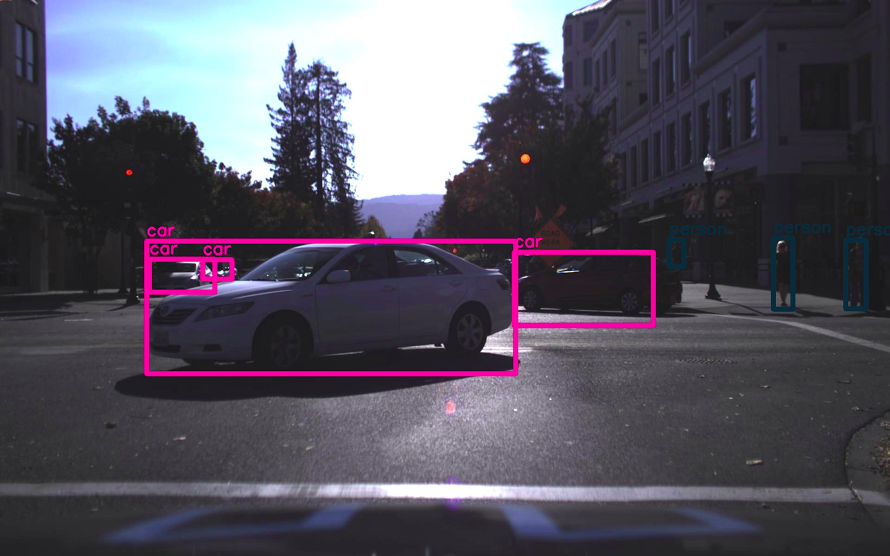

## Implementation of YoloV2 training 

Done : training loss.

To do : multi scale training, "Stronger" part in paper page 6.

## Example
I use "tiny-yolo-voc.cfg" to test my implementation of YoloV2 training.
Here are some overfitting examples:

